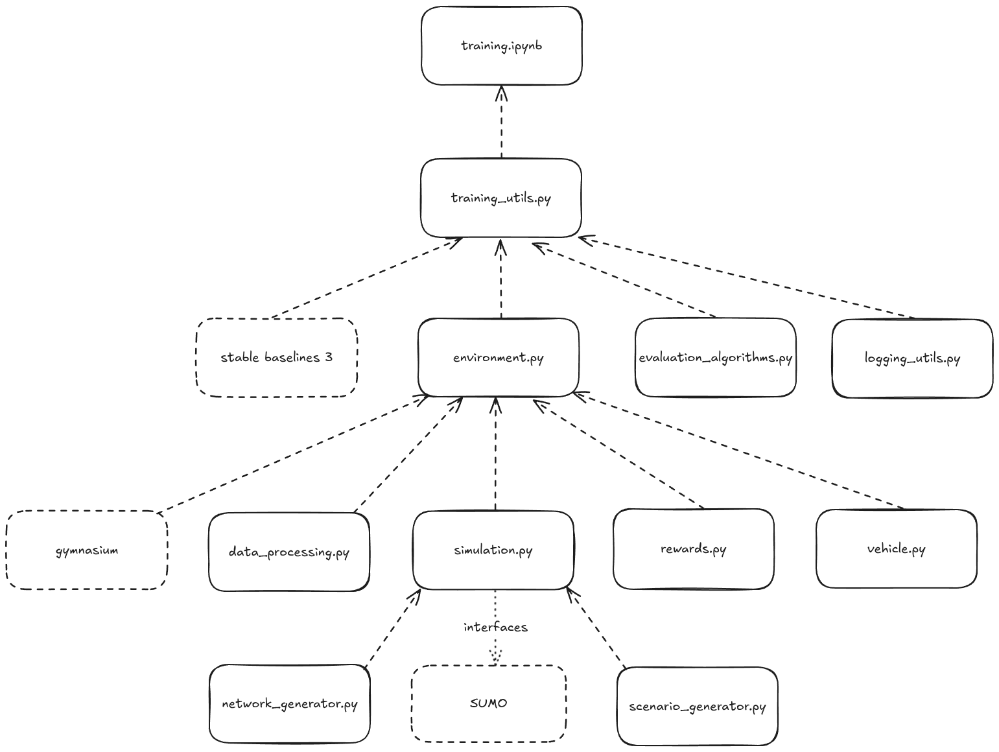

# RL environment for SUMO

---

## 🧾 Table of Contents

- [Installation](#installation)
- [Overview](#overview)
- [Project Structure](#project-structure)
- [Usage](#usage)
- [Data](#data)
- [Modeling](#modeling)
- [Results](#results)

---

## Installation
### Install SUMO (External Dependency)

This project requires **SUMO ≥ 1.26**.

Official installation instructions:

https://sumo.dlr.de/docs/Installing/index.html

Linux users may install SUMO via their package manager (see https://software.opensuse.org//download.html?project=science%3Adlr&package=sumo)

Example (Fedora 43):
    ```bash
    dnf config-manager addrepo --from-repofile=https://download.opensuse.org/repositories/science:dlr/Fedora_43/science:dlr.repo
    dnf install sumo
    ```

After installation, verify:
```bash
sumo --version
```
 > If that doesn't work: Depending on your system, `SUMO_HOME` may need to be set correctly.


Flatpak installation is possible but discouraged due to additional manual configuration steps (PATH configuration, `SUMO_HOME`, and manual TCP port exposure for TraCI).

<!-- 
SUMO is also available as a flatpak (flathub) for many linux distros. When installing as a flatpack, make sure the Path-Variable for SUMO_HOME is set. Otherwise you will get a `FileNotFound Exception` when trying to start the simulation.
  1. Find out your flatpak installation path  
      * typically `~/.local/share/flatpak/app/org.eclipse.sumo/...` (user install) or `/var/lib/flatpak/app/org.eclipse.sumo/...` (system-wide)
  1. Find exact path: `flatpak info org.eclipse.sumo`
      * typically `.../org.eclipse.sumo/x86_64/stable/active/files` (adjust based on your install; verify it contains `bin/`)
  1. Add to `~/.bashrc` file: `export SUMO_HOME=/path/to/flatpak/sumo` and `export PATH="$SUMO_HOME/bin:$PATH"`
  1. Reload your session via `source ~/.bashrc`

Furthermore, when using flatpak, you will have to explicitely start SUMO on a certain TCP port and tell TraCi to connect to it -> not recommended for comfort. 
-->
 
 <!-- TODO: supply Docker container for easy Testing for Prof. -->

### Python setup

This project uses **uv** for a fully reproducible Python environment.

1. If not already installed, install `uv` via your preferred package manager or:
    ```bash
    curl -LsSf https://astral.sh/uv/install.sh | sh
    ```

1. `uv` then installs all dependencies and the correct python version automatically into a virtual environment:
    ``` bash
    uv sync
    ```

1. You can now run the project via
    ```bash
    uv run python main.py
    ```

---

#### Notes
* Python 3.11 is automatically managed by uv.
* All dependencies are locked via uv.lock for reproducibility.
* No manual virtual environment creation is required.

---

### Optional: Install Development Tools

* To install additional development tool (e.g. Jupyter, W&B):
    ```bash
    uv sync --extra dev
    ```

* To manually activate the virtual environment:
    ```bash
    source .venv/bin/activate        # On Windows: .venv\Scripts\activate
    ```

<!-- Hint: Sobald ich ein einzelnes .py file habe, kann ich das mit der venv activation rausnehmen und stattdessen
```bash
uv run python main.py
``` -->


---

### Editing or changing the simulation street network or scenario
The underlying street network and the simulated scenarios can be easily customized and switched out. This can be done by replacing the correspondant SUMO files (circle.net.xml, circle.add.xml, circle.sumocfg).
More information can be found here: [Link to SUMO documentation]
In this way, the street network with all its attributes as well as the number, position and specifica of charging stations can be changed.

## Overview


## Project structure



### Sumo

### Simulation Interface
simulation.py

### Gymnasium Environment
environment.py

### Street Network Generator
network_generator.py

### OEV Scenario Generator
oev_scenario_generator.py
* Default scenario
* Same route scenario
* Same SOC same route scenario

### Reward Strategy
reward_strategies.py
* Basic reward strategy
* No time component reward strategy
* Reward shaping strategy

### NOEV Dataset Strategy
noev_data_provider.py
* Random data provider
* OBELIS data provider

### Training and Evaluation
training.ipynb

#### Evaluation Algorithms
evaluation_algorithms.py
* Random
* Greedy
* Never charge

## Usage

#### Experiment Tracking
Experiments can optionally be tracked using Weights & Biases.
This is not required to run the code or reproduce results.
When disabled, all results are written to local files (JSON, TensorBoard logs, model checkpoints).
To enable W&B tracking, call `train_model(...)` and `evaluate_model(...)` with the parameter `use_wandb=True`.

### Loggers

#### Interpreting tensorboard values
* `env/charging_stops_per_episode_mean`:
* `env/global_ttt`: The cumulated total travel time of all observable vehicles, in seconds.
* `env/global_ttt_only_terminated`: global_ttt but only for episodes which terminated (= were not truncated)
* `env/ttt_per_ev_mean`: global_ttt divided by the number of member EVs
* `env/ttt_per_ev_mean_only_terminated`: ttt_per_ev_mean but only for episodes which terminated (= were not truncated)
* `env/cumulated_waiting_time`:
* `env/cumulated_waiting_time_only_terminated`:
* `env/empty_vehicles_per_episode`: How many vehicles went completely empty
* `env/final_simulation_time`: The value of the final SUMO-timestep when the episode ended

### Using SUMO GUI to visually inspect evaluation runs
To actually see the vehicles when zoomed out, after the SUMO GUI opened, click on `Edit` -> `Edit Visualisation` (or press F9). There, click on the `Vehicles` tab and activate `Draw with constant size when zoomed out`.

## Data

The datasets used in this project and their documentation can be found in the "datasets" directory.

- [`./datasets/README.md`](./datasets/README.md) provides an overview of all datasets.
- Each subdirectory includes a `data_exploration.ipynb` describing the data format and usage.

## Modeling

## Results